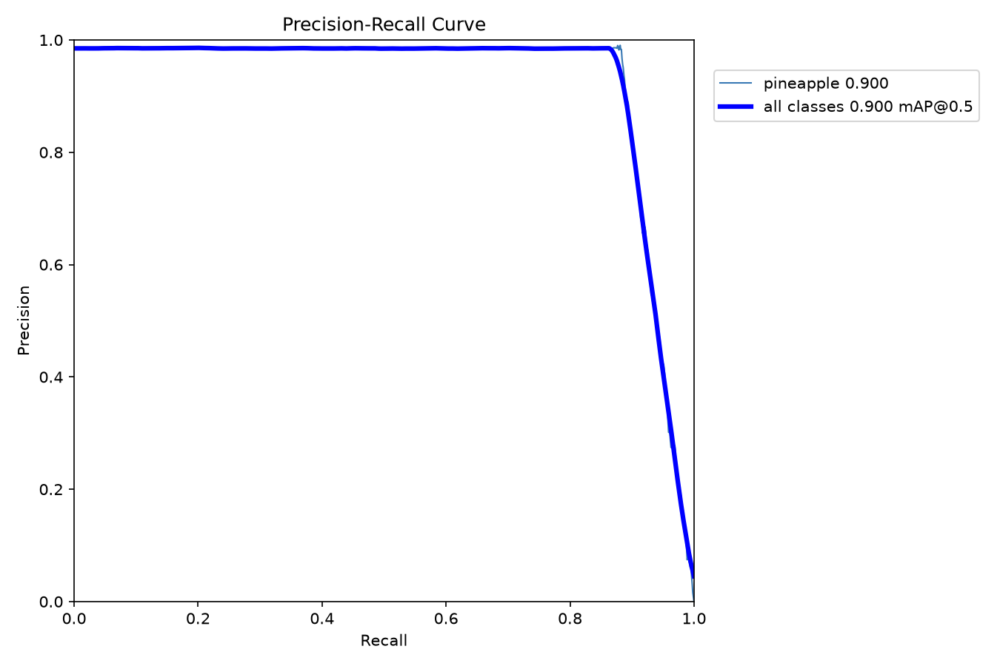
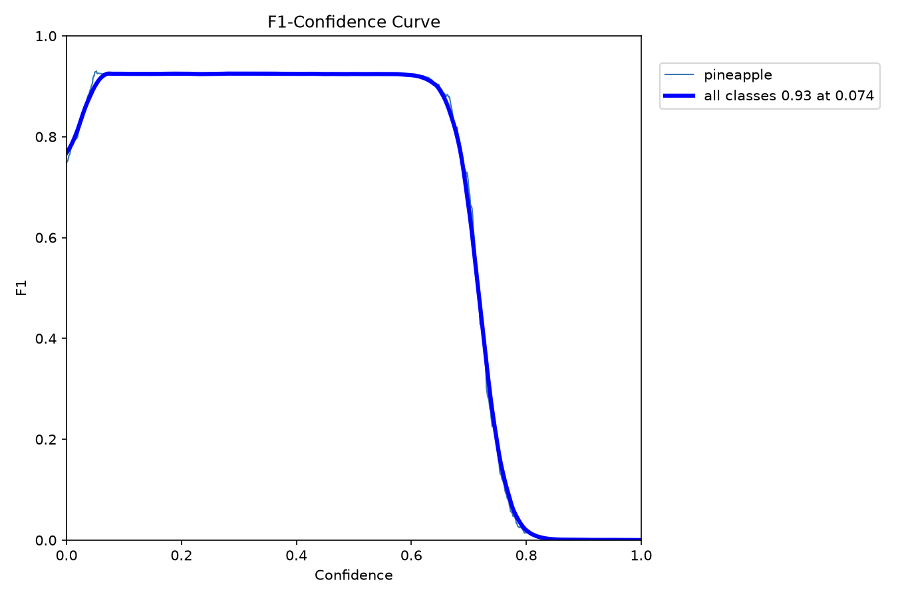
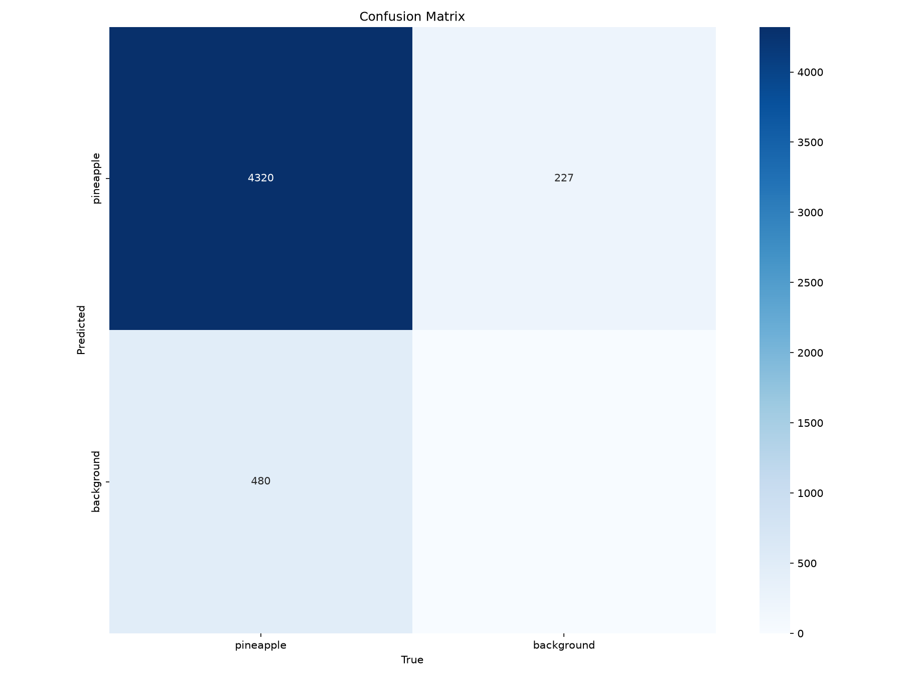

# Metrics

Evaluation for the pineapple detector and the counting pipeline.

## Detection

Axis-aligned detector, yolov10s fine-tuned for 200 epochs on
[LabelImg](https://github.com/HumanSignal/labelImg) annotations. The dataset is
320 tiles, split 70/15/15 into training, validation, and test.

| Metric | Value |
|--------|-------|
| Precision | 0.95 |
| Recall | 0.90 |
| F1 | 0.92 |
| mAP@0.5 | 0.90 |
| mAP@0.5:0.95 | 0.55 |

### Precision-recall

### F1 against confidence

### Confusion matrix

The full per-epoch loss and metric curves are the hero plot in the
[README](README.md#results).

## Counting

Measured against a manual count over one orthomosaic with the same detector.

| Metric | Value |
|--------|-------|
| Counting accuracy | 92% |
| Count error (MAPE) | 8% |

## Methodology

- One axis-aligned detector produces both the detection metrics and the
  orthomosaic counts.
- The dataset is split 70/15/15 into training, validation, and test.
- Labels are axis-aligned boxes drawn in LabelImg and exported in YOLO format.
  Confirm a checkpoint's task with `YOLO(path).task` before inference.
