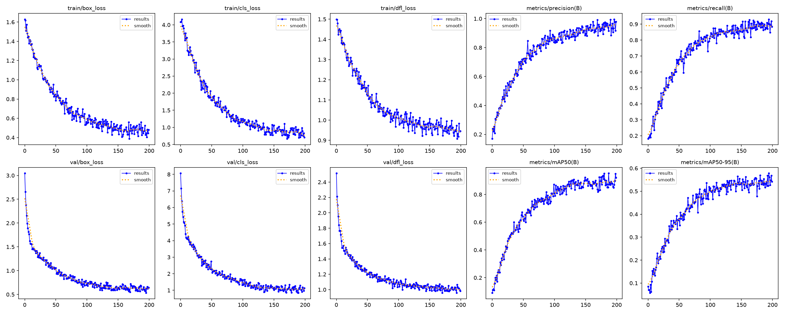
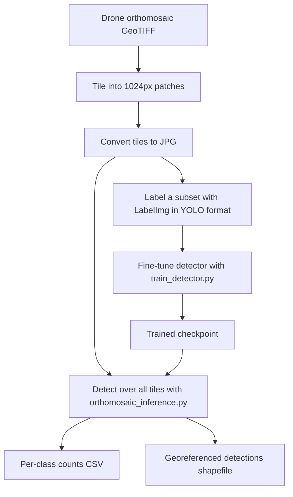

# Aerial Pineapple Counting with YOLO

A detection pipeline that counts pineapples across aerial drone imagery of a
farm and maps every plant. A YOLO detector is fine-tuned on annotated
orthomosaic tiles, then run across a full georeferenced orthomosaic to produce a
per-class count and a shapefile placing each detection on the map.

**The work was done freelance, so the trained weights and client imagery are not
included. Both are passed to the scripts as arguments.**

On the recorded run the detector reaches 0.90 mAP50 at tile level, and the
pipeline counts pineapples to within 8% of the manual count across an
orthomosaic.

> For the full metric breakdown and training curves, see [METRICS.md](METRICS.md).

## Overview

The client provided georeferenced orthomosaics captured by drone, each covering
part of the farm and each very large, on the order of tens of thousands of
pixels per side across four bands. An orthomosaic is too big to detect on
directly, so both training and counting begin by tiling it into 1024 pixel
patches, skipping the black nodata regions along the flight boundary, and
converting the patches to JPG.

For training, a subset of tiles is annotated in YOLO format with
[LabelImg](https://github.com/HumanSignal/labelImg) and used to fine-tune a
detector. For counting, the detector runs over every tile and each
detection is converted from tile pixel coordinates back to map coordinates
through the tile's affine transform. The result is a per-class count and a
shapefile that places each pineapple on the map.

## Results

The recorded run fine-tuned yolov10s for 200 epochs on a dataset of 320
annotated tiles, split 70/15/15 into training, validation, and test
(224/48/48 images).

| Metric | Value |
|--------|-------|
| Precision | 0.95 |
| Recall | 0.90 |
| F1 | 0.92 |
| mAP@0.5 | 0.90 |
| mAP@0.5:0.95 | 0.55 |
| Counting accuracy | 92% |
| Count error (MAPE) | 8% |



Precision-recall, F1, and confusion plots are in [METRICS.md](METRICS.md).

## Pipeline



## Repository structure

```
pineapple/
├── train_detector.py         fine-tune a YOLO detector on annotated tiles
├── orthomosaic_inference.py  tile, detect, count, and georeference
├── sample_dataset/           labels, image placeholders, and data.yaml
├── assets/                   metric plots from the recorded run
├── METRICS.md                detection and counting metrics with plots
└── README.md
```

## Installation

Python 3.10 or newer, in a fresh virtual environment.

```bash
pip install ultralytics rasterio geopandas shapely pillow pandas
```

Training needs a CUDA GPU for practical runtimes. Inference reads large rasters
through rasterio and needs enough memory for the source image.

## Usage

Train a detector on an annotated dataset. The argument is a YOLO data.yaml
describing the train and validation folders and the class names.

```bash
python train_detector.py path/to/dataset/data.yaml
```

Count pineapples across an orthomosaic with a trained checkpoint. Outputs land
under the work directory as a counts CSV and a detections shapefile.

```bash
python orthomosaic_inference.py path/to/orthomosaic.tif path/to/best.pt --work-dir outputs
```

## Data format

Datasets use the standard YOLO detection layout, single class, class 0 is
pineapple. Labels were drawn in LabelImg and exported as normalized YOLO
detection boxes. `sample_dataset/` includes one sample label per split plus a placeholder
standing in for each withheld image tile.

```
dataset/
├── images/{training,validation,test}
└── labels/{training,validation,test}    normalized "class cx cy w h" per line
```

## Design notes

- Images were tiled instead of downscaled. A pineapple is only a few pixels wide in the full
  orthomosaic, so downscaling to a detector-sized input would erase the target.
  Tiling at native 1024px resolution keeps each pineapple detectable.
- Georeference per tile. Each tile carries its own map transform, so a detection
  maps back to real-world coordinates with no global offset bookkeeping, and no
  single transform error can shift every detection at once.

## Notes

- The dataset data.yaml was written for Colab and now carries a placeholder
  path. Repoint train and validation before training elsewhere.
- The detector and its labels are axis-aligned boxes. Confirm a checkpoint's
  task with `YOLO(path).task` before running inference.
- Weights and client imagery are not included, and are supplied as script
  arguments.
